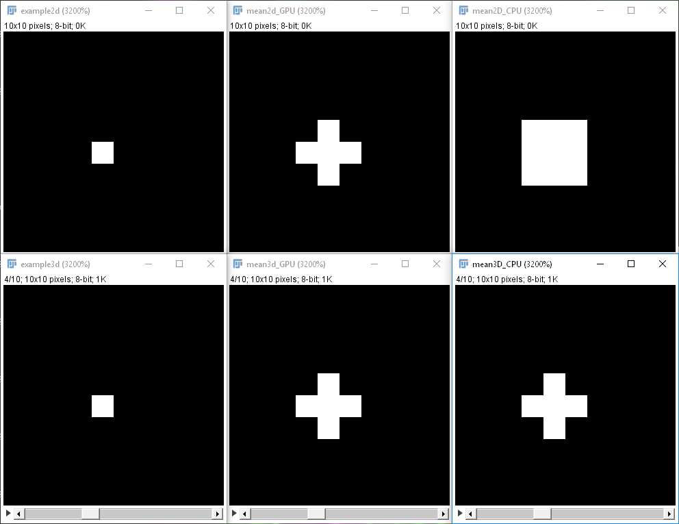

# Frequently asked questions

## Do I have to buy a dedicated GPU in order to benefit from GPU-acceleration using CLIJ?
No. Common Intel Core and AMD Ryzen processors contain built-in GPUs which are compatible with CLIJ. However, as dedicated GPUs come with their own GDDR-memory, additional speed-up can be gained by utilizing dedicated GPUs.

## Does reusing memory bring additional speed-up?
Yes. When processing images of the same size and type, it is recommended to reuse memory instead of releasing memory and reallocating memory in every iteration. An example macro demonstrating this can be found here:
https://github.com/clij/clij-docs/blob/master/src/main/macro/memory_reuse_versus_reallocation.ijm

## Are results of CLIJ filters expected to be exactly the same as when using ImageJ?
No. While algorithms on the CPU can make use of double-precision, common GPUs only support single precision for floating point numbers. Furthermore, following priorities were set while developing CLIJs filters:
* Mathematical correctness
* Constistency, e.g. between 2D and 3D filter
* Simplicity of code
* Similarity of results generated with ImageJ
For example, the minimum filter of ImageJ takes different neighborhoods into account when being applied in 2D and 3D. CLIJs filters are consistend in 2D and 3D. Thus, results may differ between ImageJ and CLIJ as shown here:

The result can be reproduced by running the following macro with radius = 1:
https://github.com/clij/clij-docs/blob/master/src/main/macro/mean_detailed_comparison_IJ_CLIJ.ijm

## Which pixel values does CLIJ take into account when processing edge pixels of the image?
CLIJ uses the strategy `clamp to edge` assuming pixels outside the image have the same pixel value as the closest border pixel of the image.

In order to simplify image processing using CLIJ from an application programming interface (API) as well as usability point of view, some general rules have been established:
* All numeric spatial parameters in CLIJ such as radius and sigma are always entered in pixels. There is no operation in CLIJ which makes use of any physical units.
* Pixel coordinates in X, Y and Z are zero-based indiced.
* Only two- and three-dimensional images are supported.
* There are no in-place operations supported in CLIJ. No operation overwrites its input images.
* The currently active image window in ImageJ plays no role in CLIJ. Input and output images must be specified in macros by name explicitly.
* If a specified output image does not exist in GPU memory, it will be generated automatically with a size defined by the executed operation with respect to input image and given parameters.
* If a specified output image exists already in GPU memory, it will be overwritten.
* CLIJ operations called from ImageJ macro have no return values. They either process pixels and save results to images or they save their results to ImageJs results table.
* Binary output images are filled with pixel values 0 and 1. Any input image can serve as binary image and will be interpreted by differentiating 0 and non-zero values.

[Back to CLIJ documentation](https://clij.github.io/)

